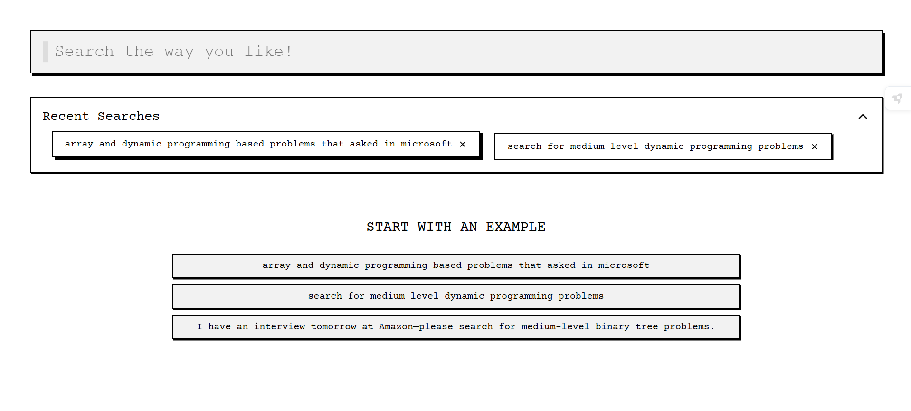

# Dask

A web application that allows users to search across 2500+ Data Structures and Algorithms (DSA) problems using natural language queries.  
For example: *“medium level dynamic programming problems”*.  
Built with **React.js** and **Next.js**, this project provides a fast and intuitive way to discover coding challenges.

---

## 🌐 Live Demo

[https://dask-omega.vercel.app/](https://dask-omega.vercel.app/)

---

## ✨ Features

- Natural language search for DSA problems  
- Filter by difficulty and topic (e.g., DP, Graph, Greedy, etc.)  
- Real-time results with smooth UI  
- Unit tested with Jest + React Testing Library  
- Performance optimized with Chrome Lighthouse  

---

## 🛠️ Technologies Used

- [React.js](https://reactjs.org/)  
- [Next.js](https://nextjs.org/)  
- [JavaScript](https://developer.mozilla.org/en-US/docs/Web/JavaScript)  
- [Jest](https://jestjs.io/)  
- [React Testing Library](https://testing-library.com/docs/react-testing-library/intro/)  
- [Chrome Lighthouse](https://developer.chrome.com/docs/lighthouse/overview/)  

---

## 🎥 Demo Video

[](https://vimeo.com/1123524107)

*(Click the image above to watch the demo on Vimeo)*  

---

## 📦 Installation

Clone the repository:

```bash
git clone https://github.com/Rajnish8292/dask.git
cd dask
```
Install dependencies:
```bash
npm install
# or
yarn install
```

Run the development server:
```bash
npm run dev
# or
yarn dev
```

🧪 Testing

Run unit tests:
```bash
npm run test
```

Open http://localhost:3000 to view the app in your browser.

## Author
Made by Rajnish Raj
### Connect on [LinkedIn](https://www.linkedin.com/in/rajnish-raj-9139602a4/)
 
